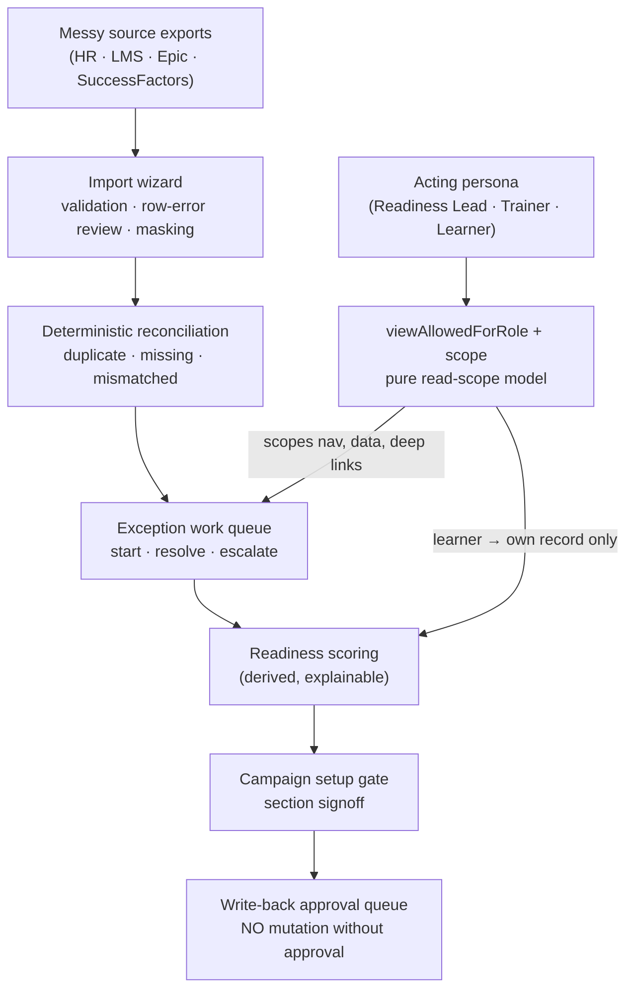

# Ops Command Center — "The tool I needed in 2015"

**A training-operations command center for campaign-based readiness — the operations layer *above* the LMS, not another one.**
Reconcile messy roster / completion / Epic exports into a trusted readiness picture, work a deterministic
exception queue to zero, and gate go-live behind an approve-before-write-back pipeline with role-scoped
visibility — one workspace for the readiness leads, training coordinators, and program managers running a
large activation.

`React` · `Vite` · `JavaScript` · token-driven design system · role-aware cockpit

**▶ [Live demo](https://garthpuckerin-ops-command-center.vercel.app)** · [Case study](https://garthpuckerin.com/project-ops-command-center) · [garthpuckerin.com](https://garthpuckerin.com)

> **This is the cockpit, not the engine.** A sanitized, mock-data demo of the product experience. The
> production backend — FastAPI / Postgres, source-system connectors (HR / LMS / Epic / SuccessFactors),
> the deterministic reconciliation engine, the governed write-back pipeline, and a governed local-AI
> layer — is a separate private codebase. See [What's real vs. illustrative](#whats-real-vs-illustrative).

---

## The problem

Complex, multi-stakeholder go-lives fail in the seams. An Epic activation, an LMS migration, a compliance
rollout: hundreds of departments, facilities, roles, and training tracks that all have to hit *ready* on
the same day — coordinated in spreadsheets nobody trusts, from source systems that never quite agree. The
data arrives messy, and the job is to make it trustworthy: reconcile the exports, surface the exceptions,
and prove readiness before the cutover.

This is **not an LMS**. It is the operational command-center layer *between* the systems of record (HR, the
LMS, Epic, SuccessFactors) and the daily coordination of getting people ready. Its guiding principle:
**allow messy to create efficiency** — accept inconsistent real-world data first, then earn a trusted
dashboard through validation, reconciliation, and signoff. The seed was a 2015 hospital Epic go-live; this
is that instinct rebuilt a decade later as a configurable platform, its first workflow being **Epic
go-live readiness**.

## What it shows

- **Campaign command center** — a readiness lead's home for a live activation: days-to-go-live, overall
  readiness, critical-role coverage, and open exceptions, all derived from one dataset and scoped by RBAC.
- **RBAC read-scope** *(signature discipline)* — switch the acting persona (Readiness Lead / Trainer /
  Learner) and what's visible genuinely changes: the nav scopes, the campaign list scopes, a learner sees
  only their own record, and **deep links to admin surfaces are guarded** — not a relabeled shell.
- **Messy-import → reconcile → exception queue** *(signature workflow)* — a CSV import wizard (roster,
  training matrix, completions) with validation, row-error review, and sensitive-column masking →
  deterministic reconciliation (duplicate / missing / mismatched) → a unified exception work queue you
  actually work: start, resolve, escalate, with resolution notes.
- **Readiness scoring → setup gate → write-back approval** *(signature workflow)* — deterministic
  readiness scoring feeds role-based campaign homes → a campaign setup gate with section signoff → a
  **write-back approval queue where nothing mutates a system of record without an authorized reviewer's
  approval** (staged payloads, approve / reject with a note).
- **Governed AI suggestions** — a suggestion-only workspace: every task derives a distinct,
  campaign-grounded suggestion that **cites the records it drew from**, is explicitly marked *mutation not
  allowed*, and stages for human review — never asserts authority.
- **Everything works end to end on mock data** — switch campaigns, work an exception to resolved, approve
  a write-back, run a governed-AI suggestion — and the change re-derives across the screens that show it.
- **A companion mobile surface** and a token-driven design system (light / dark presentation theme +
  density) that applies live.

## Architecture — messy in, trusted out

Two disciplines carry the demo. **Coherence:** readiness, department rollups, and exception counts derive
from a single dataset, so a campaign's figures always agree — department rollups reconcile to the total,
and an Active campaign's go-live is always ahead of today (enforced by a fixture-coherence gate).
**Authority:** what an acting persona can see and reach is a pure function of role — the nav, the data
scope, and guarded deep links all derive from one permission model, so switching role changes what you can
*do and see*, not just the label.



## What's real vs. illustrative

Honesty matters more than polish, so here's the exact boundary:

| Aspect | In this public demo | In the private production build |
|---|---|---|
| **Data** | Mock fixtures, deterministically date-shifted so a campaign always looks current | FastAPI / Postgres campaign domain (123 backend tests), tenant-scoped, with CSV import providers and source-system connectors |
| **RBAC** | **Real read-scope** (`viewAllowedForRole` + `ROLE_NAV` + campaign scoping + own-record) — the persona switch changes nav, data, and **guarded deep links**, not just the label | Real auth + server-enforced campaign RBAC scoping at the API layer, with an audit trail |
| **Import & reconciliation** | **Real** import-wizard UX + a deterministic exception queue you work end to end, in memory | Real manual-CSV import provider (idempotent, duplicate-safe) + a deterministic reconciliation rule service that generates the exceptions |
| **Write-back approval** | **Real** staged approve/reject state machine with reviewer notes — nothing mutates a system of record | The write-back approval queue with staged payloads; the SuccessFactors / LMS / Epic adapters that *execute* approved write-backs are private (adapter execution on the roadmap) |
| **Readiness scoring** | Derived from one dataset, explainable | Configurable deterministic readiness scoring with explanations |
| **Governed AI** | **Real** suggestion-only interaction — per-task, fixture-grounded suggestions with citations, marked *mutation not allowed*, stage-for-review | Governed AI endpoints (readiness briefs, exception summaries, escalation drafts, match suggestions) behind a suggestion-only orchestration boundary with deterministic provenance |
| **Persistence** | In-memory / localStorage | Postgres |
| **Integrations & write-back** | Explained in place — nothing is sent | HR / LMS / Epic / SuccessFactors connectors + governed write-back; a local-AI (Ollama) option behind a PHI-redaction policy |
| **Backend** | None — frontend only | Private codebase (FastAPI · Postgres · deterministic reconciliation + scoring · governed AI layer) |

The production engine is private by design — the demo proves the *product experience, the go-live domain
fluency, and the data-modeling discipline*; the engine is the IP.

## Run it locally

```bash
npm install
npm run dev          # Vite dev server
npm run build        # production build
npm run test:unit    # fixture-coherence + governed-AI gates (node --test)
npm run test:e2e     # Playwright: smoke, RBAC read-scope, §4b empty states
npm run sweep:whiteglove   # text-defect + inert-affordance sweep (needs the dev server)
npm run sweep:mobile       # mobile/tablet layout sweep
npm run sweep:viewport     # 15-viewport layout sweep
```

## Stack

React · Vite · JavaScript · a token-driven design system (theme / density) · `node --test` for the
coherence and governed-AI gates · Playwright for e2e and the layout sweeps. No backend — every figure is
derived client-side from the mock campaign dataset.

---

*Built by [Garth Puckerin](https://garthpuckerin.com). One system revealed every Thursday.*
