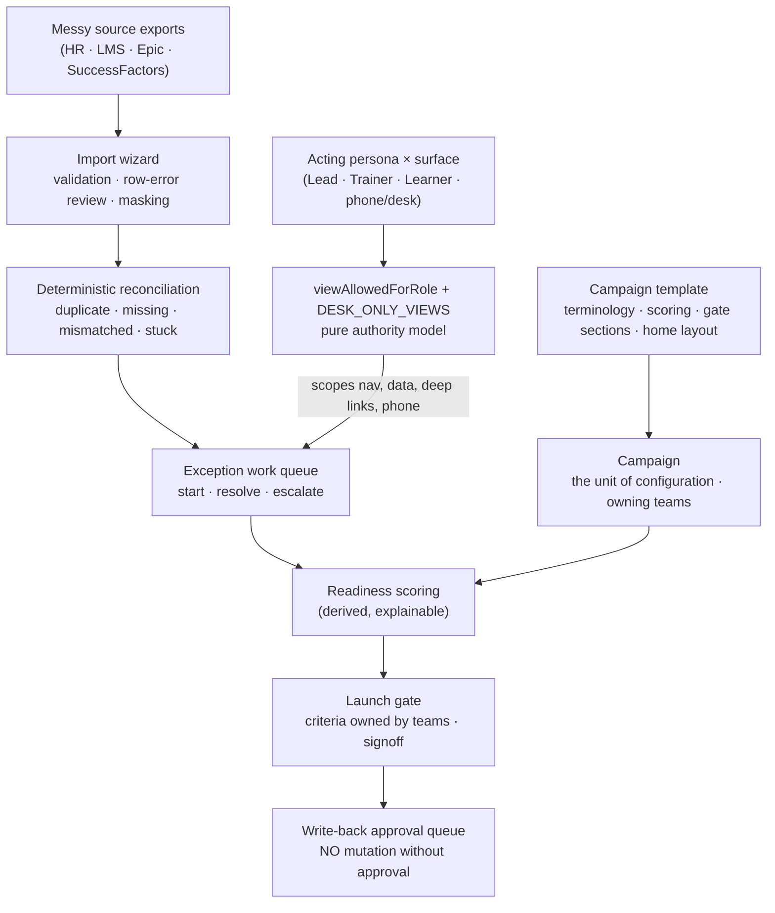

# Ops Command Center — "The tool I needed in 2015"

**An LMS-shaped, campaign-configurable operations command center.** Users, courses, completions, and roles
are the substrate; *templates* configure the same engine into fundamentally different operations; and
**the campaign is the unit of configuration** — the real go-live behind this product ran six teams each
owning different launch criteria, while a compliance cycle runs on one. The demo runs **two live
operations** from one engine: an Epic go-live and an annual compliance cycle.

`React` · `Vite` · `JavaScript` · token-driven design system · role-aware cockpit · surface-scoped mobile companion

**▶ [Live demo](https://garthpuckerin-ops-command-center.vercel.app)** · [Case study](https://garthpuckerin.com/project-ops-command-center) · [garthpuckerin.com](https://garthpuckerin.com)

> **This is the cockpit, not the engine.** A sanitized, mock-data demo of the product experience. The
> production backend — FastAPI / Postgres, source-system connectors (HR / LMS / Epic / SuccessFactors),
> the deterministic reconciliation engine, the governed write-back pipeline, invite-based provisioning,
> and a governed local-AI layer — is a separate private codebase. See
> [What's real vs. illustrative](#whats-real-vs-illustrative).

---

## The problem

Complex, multi-stakeholder implementations fail in the seams. An Epic activation, an acquisition
onboarding, a compliance cycle: hundreds of departments, facilities, roles, and training tracks that all
have to hit *ready* on the same day — coordinated in spreadsheets nobody trusts, from source systems that
never quite agree. The data arrives messy, and the job is to make it trustworthy: reconcile the exports,
surface the exceptions, and prove readiness before the deadline.

The platform is LMS-shaped — it is *not another LMS*, and not an Epic-only utility — it is the operational
command-center layer between the systems of record and the daily coordination of getting people ready. Its
guiding principle: **allow messy to create efficiency** — accept inconsistent real-world data first, then
earn a trusted dashboard through validation, reconciliation, and signoff. The seed was a 2015 hospital Epic
go-live; this is that instinct rebuilt a decade later as a configurable platform.

## One engine, two live operations

- **Epic Go-Live Readiness** — the flagship: an executive command center counting down to go-live, a
  launch gate with owned and signed-off criteria, department and facility scorecards, a training matrix,
  and a governed exception queue worked to zero.
- **Annual Compliance Cycle** — same engine, different shape: the campaign counts down to a *deadline*,
  tracks per-assignee completion, and runs the compliance signature rule — an assignee past a configured
  time-in-course threshold *without completing* is flagged **stuck** and escalated into the same queue. A
  stuck learner is a rescue; a never-started one is a nudge. The system knows the difference.
- **Scenario packs are the front door** — each pack names its demo campaign and opens it live; packs still
  on the roadmap say so honestly instead of faking a door.

## The campaign is the unit of configuration

- **Switching campaigns changes the home's shape, not just its numbers** — an executive command center, an
  analyst's import-and-reconciliation home, a team follow-up home, a compliance completion watch.
- **Terminology follows the template** — one campaign reaches *go-live*, another a *cutover*, another a
  *deadline*, across every scoped screen (sidebar, header, countdowns included).
- **Teams are the activation model** — the go-live runs six owning teams, each with a focus, lead, and a
  live rollup of the criteria and open blockers it owns; the compliance cycle runs one. Ownership derives
  from each record's owner through team membership — no hand-stamped ids to drift.
- **Creating a campaign instantiates its template** — scoring thresholds, starter requirements, default
  reports, the launch-gate sections, and a starter team all seed from the chosen template; the new campaign
  opens in that template's home layout. Nothing arrives pre-approved.

## Governed by design

- **Deterministic, explainable readiness scoring** — adjust a weight and the number recomputes live from the
  same formula the dashboard uses, with every driver shown.
- **Messy-import → reconcile → resolve** — a CSV wizard with validation, row-error review, and
  sensitive-column masking; applying it creates the valid learners *and* raises reconciliation exceptions,
  and the campaign's risk count moves live on every surface.
- **Approve before write-back** — nothing reaches a system of record without a reviewer approving the
  staged payload. **Suggestion-only AI** cites the records it used, carries a confidence, and cannot mutate.
- **Governed provisioning** — invite people with a named role and explicit campaign access, see the exact
  grant before it exists, and queue it for acceptance; invites are staged, revocable, and nothing is ever
  silently created.
- **RBAC read-scope, actually enforced** — switching persona changes what you can *reach*, not just what
  you see; out-of-scope deep links fall back instead of rendering admin surfaces.
- **Surface-scoped authority** — the phone is a monitoring/triage companion: readiness, the queue, and
  alerts travel; approvals, imports, scoring, and configuration render a deliberate desk-only state
  instead of thumb-sized authority over systems of record.

Session logistics carry the 2015 lineage forward under the same governance: schedule creation and
instructor assignment are deterministic — constraint rules, not model guesswork — with agentic assistance
only where it earns its place, and always behind human review; approved schedules reach the system of
record by governed write-back, export-for-import, or manual entry. The demo monitors the result.

## Architecture — messy in, trusted out

Two disciplines carry the demo. **Coherence:** every displayed aggregate derives from the record arrays —
readiness, department rollups, exception counts, team rollups, stuck flags — so a campaign's figures always
agree, and a hand-typed count fails the build. **Authority:** what a persona can see and reach is a pure
function of role *and surface* — nav, data scope, guarded deep links, and the phone's desk-only states all
derive from one policy model.



## What's real vs. illustrative

Honesty matters more than polish, so here's the exact boundary:

| Aspect | In this public demo | In the private production build |
|---|---|---|
| **Data** | Mock fixtures, deterministically date-shifted so a campaign always looks current | FastAPI / Postgres campaign domain, tenant-scoped, with CSV import providers and source-system connectors |
| **Templates & campaigns** | **Real** template binding, per-campaign terminology/home/gate/scoring, and create-from-template instantiation, in memory | Template-driven campaign creation against the campaign domain |
| **Teams** | **Real** per-campaign teams with membership-derived ownership and live rollups | A team entity with user membership; ownership policy decided at design time |
| **Compliance / stuck detection** | **Real** rule over per-assignee time-in-course fixtures; stuck assignees surface as queue exceptions | Time-in-course telemetry from the LMS import pipeline + a rules job that raises/closes exceptions idempotently |
| **RBAC & surface authority** | **Real** read-scope (`viewAllowedForRole` + campaign scoping + own-record) and desk-only states on the phone (a viewport proxy, not a security boundary) | Real auth, server-enforced campaign RBAC, and device/session policy on the mutation endpoints |
| **Import & reconciliation** | **Real** import-wizard UX + a deterministic exception queue you work end to end | Idempotent, duplicate-safe CSV import provider + a deterministic reconciliation rule service |
| **Write-back approval** | **Real** staged approve/reject state machine with reviewer notes — nothing mutates a system of record | The approval queue with staged payloads; the adapters that *execute* approved write-backs are private |
| **Provisioning** | **Real** queued/role-validated/revocable invites with a grant preview — nothing is provisioned | `POST /users` and `POST /users/bulk-invite` with roles, role assignments, invite tokens, and acceptance |
| **Readiness scoring** | Derived from one dataset, explainable, live-tunable | Configurable deterministic scoring with explanations |
| **Governed AI** | **Real** suggestion-only interaction with citations, marked *mutation not allowed* | Governed AI endpoints behind a suggestion-only orchestration boundary with deterministic provenance |
| **Persistence** | In-memory / localStorage | Postgres |
| **Backend** | None — frontend only | Private codebase |

The production engine is private by design — the demo proves the *product experience, the domain fluency,
and the data-modeling discipline*; the engine is the IP.

## Built like a product

The demo ships behind a real gate suite, and it is run on every change:

- **Unit (`node --test`)** — fixture coherence (rollups reconcile, no future-dated history, seeded scores
  equal derived scores), template binding, compliance rule + fixture invariants (a derivably-stuck assignee
  must exist and must have an open exception), template instantiation, team ownership (alias unambiguity,
  every criterion owned), invite semantics, and constant-length permission grants so the invite preview can
  never resize.
- **End-to-end (Playwright)** — smoke with zero console/page/network errors, RBAC deep-link guards,
  per-campaign shapes, the compliance operation, template instantiation, teams, surface-scoped mobile
  authority (including a full phone-tour walk), the invite flow with a *measured* no-resize assertion,
  campaign-scoped filters and reports.
- **Sweeps** — white-glove (text defects, inert affordances), mobile across 5 viewports, layout across 19.

## Run it locally

```bash
npm install
npm run dev          # Vite dev server (port 3200)
npm run build        # production build
npm run test:unit    # coherence, binding, compliance, teams, invites, governed-AI gates (node --test)
npm run test:e2e     # Playwright journeys
npm run sweep:whiteglove   # text-defect + inert-affordance sweep (needs the dev server)
npm run sweep:mobile       # phone/tablet layout sweep
npm run sweep:viewport     # 19-viewport layout sweep
```

## Stack

React · Vite · JavaScript · a token-driven design system (theme / density) · `node --test` for the
structural gates · Playwright for e2e and the layout sweeps. No backend — every figure is derived
client-side from the mock campaign dataset.

---

*Built by [Garth Puckerin](https://garthpuckerin.com). One system revealed every Thursday.*
